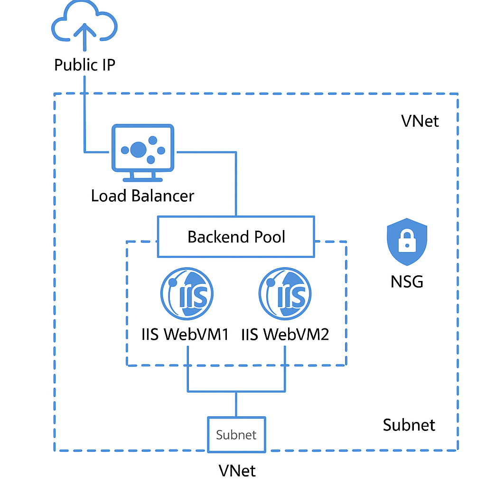

# 🧩 Lab 02: Load Balancing & High Availability  
**Author:** Jenny Wang (@JennyCloud)  
**Lab Goal:** Deploy a highly available two-tier web service using an Azure Load Balancer to distribute HTTP traffic between IIS servers.  
**Tools:** Azure Portal + PowerShell (Az Module)

---

## 🏗️ Architecture Overview

This lab demonstrates how Azure Load Balancer enables high availability and scalability by routing incoming web requests across multiple backend VMs.  
Each component was provisioned and secured using real-world methods applied in managed-service environments.

**Core Components**
- **VNet:** `LB-Lab-VNet` — hosts the entire environment  
- **Subnet:** `WebSubnet` — isolates IIS servers from external access  
- **NSG:** `Web-NSG` — allows ports 80 (HTTP) and 3389 (RDP)  
- **VMs:** `WebVM1` & `WebVM2` — Windows Server 2022 IIS servers  
- **Load Balancer:** `Web-LB` — Standard SKU, public frontend IP (HTTP port 80)  
- **Probe:** `TCP-Probe` — health checks on port 80 for backend availability  

---

## ⚙️ Steps Performed

### **1️⃣ Create Resource Group & Network**
`create-network.ps1` provisions the **VNet**, **Subnet**, and **NICs** for both VMs.

### **2️⃣ Configure NSG**
`create-nsg.ps1` creates `Web-NSG` with inbound rules:
- Allow HTTP (80)
- Allow RDP (3389)

### **3️⃣ Deploy Web VMs**
`create-vms.ps1` provisions **two Windows Server 2022** instances (or via Portal if Trusted Launch prevents automation).  
Each VM uses a pre-created NIC and joins the same subnet.

### **4️⃣ Install IIS & Verify**
`install-iis.ps1` installs and tests the IIS Web Server role on both VMs.  
Verification: `http://<VMPrivateIP>` returns *“IIS Windows Server”*.

### **5️⃣ Create Public Load Balancer**
`create-loadbalancer.ps1` builds:
- Public IP: `LB-PublicIP`
- Frontend Config: `LB-Frontend`
- Backend Pool: `LB-Backend`
- HTTP Probe → later replaced with TCP Probe for reliability
- Load Balancing Rule: `HTTP-Rule`

### **6️⃣ Troubleshooting & Fix**
`fix-loadbalancer.ps1` replaces the HTTP probe with a TCP probe to ensure successful health checks.  
Diagnostics included:
- IIS endpoint testing (`Invoke-WebRequest http://localhost`)
- Rule and probe validation
- Confirmed traffic distribution via public IP (`20.xx.xx.xx`)

---

## 🧠 Lessons Learned

- **Trusted Launch VMs** require specific feature registration — workaround: deploy via Portal.  
- **HTTP probe paths** can fail if IIS returns non-200 codes; TCP probe is a simpler fallback.  
- **Backend pool attachments** must target the NIC’s IP configuration explicitly.  
- **Diagnostics tools** (`Test-AzNetworkConnectivity`, `Get-AzLoadBalancer`) help trace packet flow.  

---

## 📸 Screenshots
- `iis-install-success.png` — IIS installed successfully  
- `webvm1-page.png` / `webvm2-page.png` — local IIS tests  
- `loadbalancer-success.png` — web page served via public LB IP  
- `architecture-diagram.png` — architecture diagram  

---

## 📂 Files Included
| File | Description |
|------|--------------|
| `create-network.ps1` | Sets up VNet, Subnet, NICs |
| `create-nsg.ps1` | Defines security rules |
| `create-vms.ps1` | Deploys Windows Server VMs |
| `install-iis.ps1` | Installs IIS and tests connectivity |
| `create-loadbalancer.ps1` | Builds Azure Load Balancer |
| `fix-loadbalancer.ps1` | Replaces probe and fixes routing |

---

## 🚀 Outcome
The final setup delivers:
- **High Availability** through load balancing between two VMs  
- **Scalability** for future web tiers  
- **Resilience testing** skills demonstrated via diagnostics and fix scripts  

This lab mirrors how **MSPs** maintain customer uptime, troubleshoot network flows, and apply incremental fixes without downtime — the same skills expected from a junior cloud administrator in production support roles.
