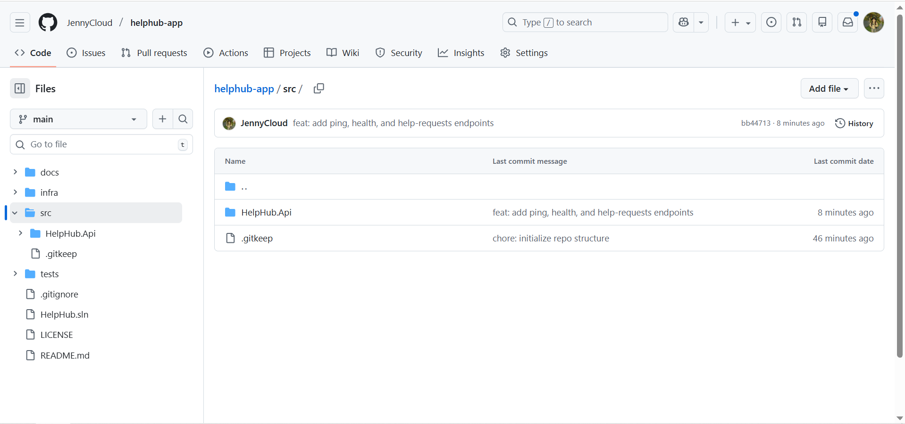
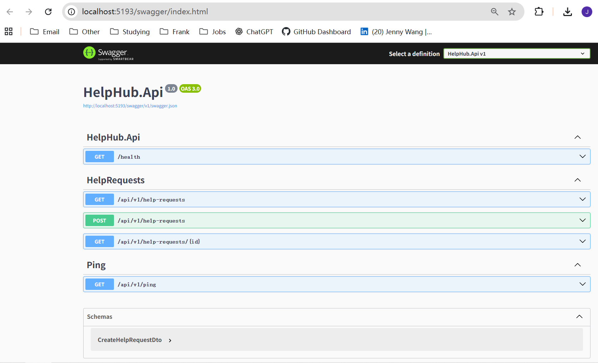
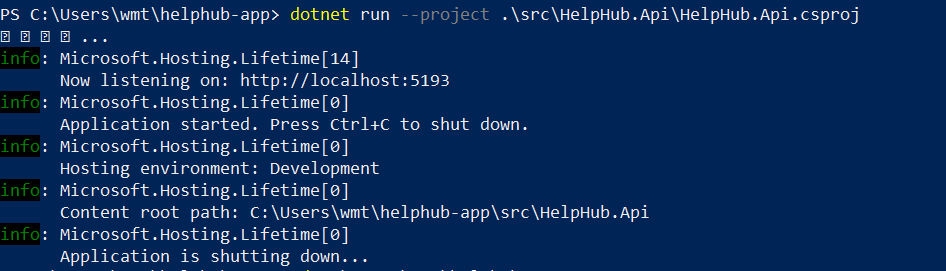
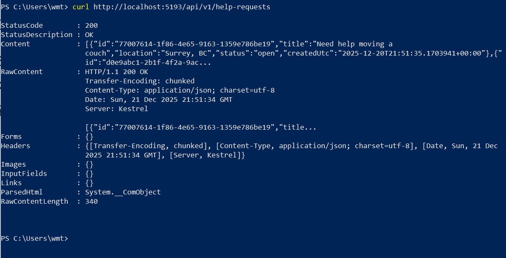
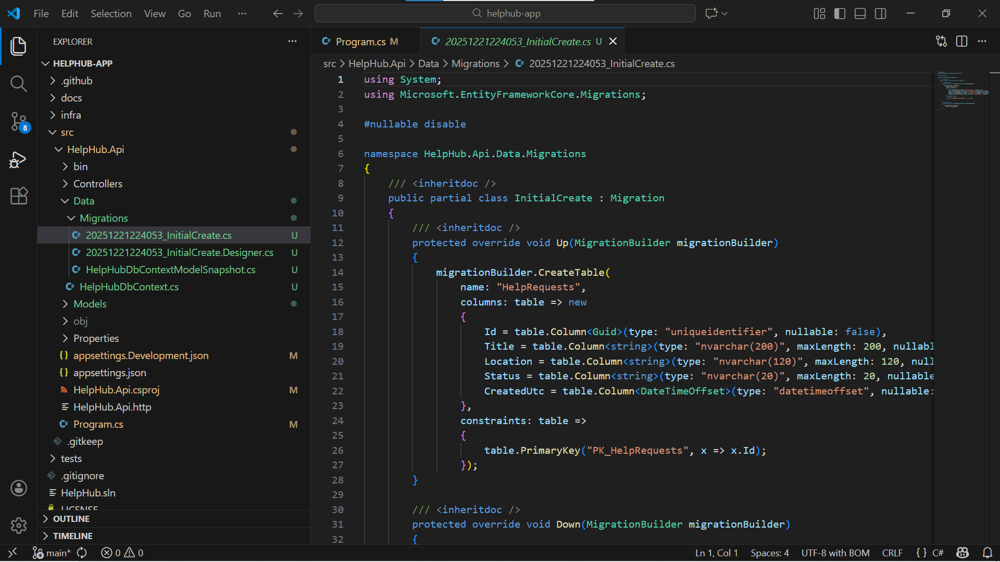
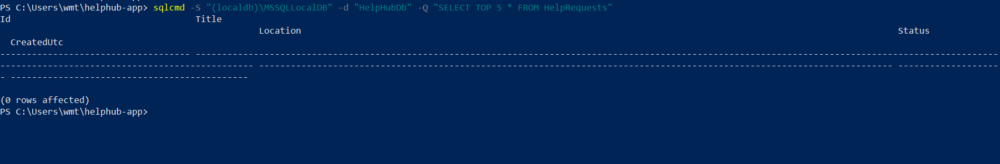
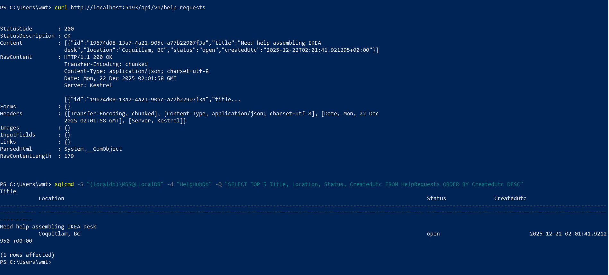
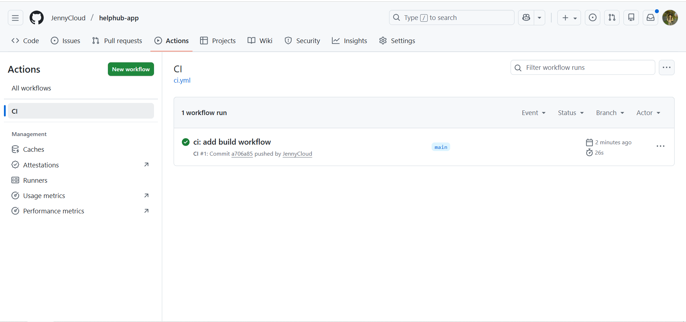

# Lab05 — HelpHub Community Exchange (C#/.NET + SQL + Azure-ready)

**Goal:** Build a community help exchange backend where people can post requests (and later offers), backed by SQL and designed to deploy to Azure with CI/CD.

**Source Code Repo:** https://github.com/JennyCloud/helphub-app

---

## What I built (so far)

### ✅ Backend API (ASP.NET Core .NET 8)
- Versioned REST API routes under `/api/v1`
- Health endpoint for load balancers / uptime checks
- Swagger UI for interactive API testing

### ✅ Database (SQL Server LocalDB) + EF Core
- Code-first data model using Entity Framework Core
- First migration created database + `HelpRequests` table
- API persistence verified end-to-end:
  - POST request → saved to SQL → SELECT query returns row

### ✅ CI (GitHub Actions)
- CI workflow builds the solution on every push/PR to `main`

---

## Architecture (current)

**Today:** Local development stack  
- Client (curl / Swagger)
- ASP.NET Core Web API
- SQL Server LocalDB (HelpHubDb)

**Next (Azure):**  
- Deploy API to Azure compute (App Service or Container Apps)
- Use Azure SQL Database
- CD pipeline via GitHub Actions (OIDC)

---

## API endpoints

| Method | Route | Description |
|---|---|---|
| GET | `/health` | Health check for service monitoring |
| GET | `/api/v1/ping` | Quick smoke test endpoint |
| GET | `/api/v1/help-requests` | List help requests (from SQL) |
| GET | `/api/v1/help-requests/{id}` | Get help request by id |
| POST | `/api/v1/help-requests` | Create a new help request |

---

## Local run (developer workflow)

### Prerequisites
- .NET SDK 8.x
- SQL Server LocalDB (Windows default)

### Run the API
cd C:\Users\wmt\helphub-app
dotnet run --project .\src\HelpHub.Api\HelpHub.Api.csproj

### Swagger
Open:
- `http://localhost:5193/swagger`

### Quick tests
curl http://localhost:5193/health
curl http://localhost:5193/api/v1/ping
curl http://localhost:5193/api/v1/help-requests

Create a request:
Invoke-RestMethod -Method Post -Uri "http://localhost:5193/api/v1/help-requests"
-ContentType "application/json" `
-Body '{"title":"Need help assembling IKEA desk","location":"Coquitlam, BC"}'

Verify SQL persistence:
sqlcmd -S "(localdb)\MSSQLLocalDB" -d "HelpHubDb" -Q "SELECT TOP 5 Title, Location, Status, CreatedUtc FROM HelpRequests ORDER BY CreatedUtc DESC"

---

## Screenshots (proof)

> Store screenshots here: `screenshots/`

1. GitHub repo structure  
   

2. Swagger endpoints  
   

3. API running in terminal  
   

4. Help requests API response  
   

5. EF Core migration creating DB/table  
   

6. Migration files in repo (VS Code)  
   

7. SQL query shows table exists (empty at first)  
   

8. SQL query shows persisted row (POST → DB)  
   

9. GitHub Actions CI success  
   

---

## Next steps (Azure deployment plan)

1. Choose compute:
   - Option A: **Azure App Service**
   - Option B: **Azure Container Apps**
2. Provision Azure resources with **Bicep** (`infra/`)
3. Deploy using **GitHub Actions** with **OIDC**
4. Switch connection string to **Azure SQL Database**
5. Add basic auth (Entra ID / JWT) + roles
6. Add offers + matching workflow (HelpOffer, Conversations, etc.)

---

## Repo links
- App repo: https://github.com/JennyCloud/helphub-app
- Portfolio lab: `Azure-Zero-to-Hero/Azure-RealWorld-Labs/Lab05-HelpHub-Community-Exchange/`
