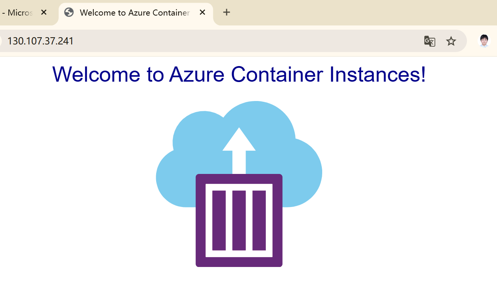

# ☁️ Lab 3 – Azure Container Instance (ACI)

## 🧠 Overview
This mini lab demonstrates how to deploy a lightweight, publicly accessible container in **Azure** without managing any virtual machines.  
Using **Azure CLI (Bash)**, I launched a simple “Hello World” web app hosted on **Azure Container Instances (ACI)** — a fast and cost-efficient way to run containers directly in the cloud.

---

## 🌎 Architecture
The container runs inside an **Azure Container Group** within a resource group named **MiniLabs-RG** in the **Canada Central** region.  
It automatically receives a **public IP address** and **DNS label** so it can be accessed via HTTP on port 80.  
This setup demonstrates how Azure manages container orchestration and networking behind the scenes — no VM or Kubernetes cluster required.

---

## 🧩 Learning Focus
- Used **Bash (Azure CLI)** to automate deployment  
- Practiced **resource-provider registration** for ACI  
- Configured **public access and DNS labels**  
- Verified **container status and connectivity**  
- Practiced **resource cleanup and cost control**

---

## 📸 Result
After deployment, browsing to the container’s public IP or FQDN displayed a blue **“Welcome to Azure Container Instances”** page — confirming a successful deployment.

---

## 🧰 Troubleshooting I Did
During setup, I encountered and resolved several common issues:

| Issue | What I Learned / Fix |
|:--|:--|
| **MissingSubscriptionRegistration** | Registered the `Microsoft.ContainerInstance` provider using `az provider register`. |
| **Invalid OS Type** | Added `--os-type Linux` to specify the container runtime. |
| **Resource Not Found** | Waited for provisioning to finish and used `az container list` to verify resources. |

These steps strengthened my understanding of how Azure’s CLI feedback helps with quick debugging.

---

## 💬 Q&A Highlights

**What is Azure Container Instance (ACI)?**  
A serverless container service that runs containers directly on Azure without VM management or cluster orchestration.  

**How does ACI differ from AKS (Azure Kubernetes Service)?**  
AKS manages clusters for long-running microservices; ACI is for quick, standalone, or on-demand containers.  

**When would you use ACI?**  
For testing, batch jobs, short-term tasks, or lightweight apps that don’t require Kubernetes.  

**How is security handled in ACI?**  
Each container runs in an isolated sandbox with controlled networking and optional private endpoints.  

---

## ✅ Summary
This lab showed how quickly a containerized application can run on Azure using **Bash and CLI automation**.  
It reinforces core skills in resource management, networking, and lightweight compute deployment — without maintaining any virtual machines.
